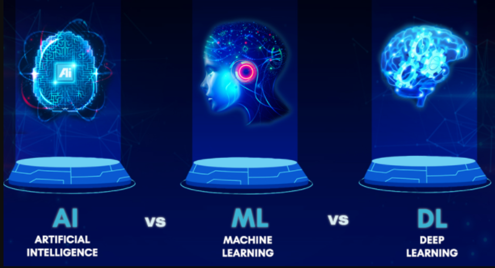
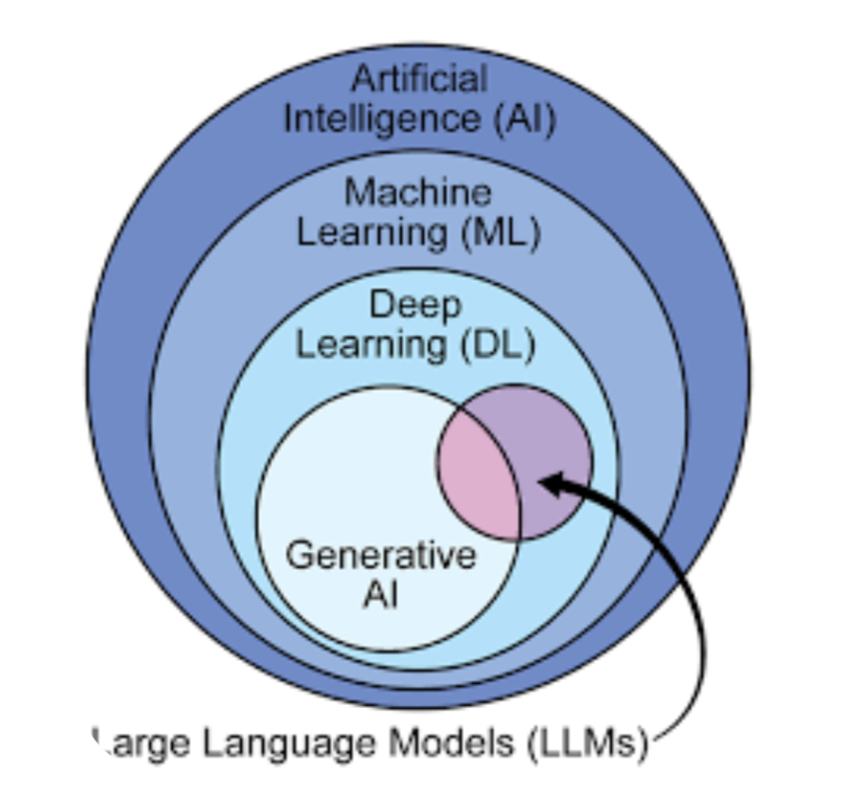

# Day 1 — Task 1: Understanding AI, ML, DL, GenAI, LLMs, Deepfakes and Chatbots  

##  Overview  
This task focuses on building a **strong foundation in Artificial Intelligence (AI)** by exploring key terminologies.  
In today’s tech-driven world, words like **AI, ML, DL, and GenAI** are often used interchangeably, but each has a distinct role.  
Understanding these terms clearly will help in mastering advanced AI concepts in the upcoming tasks.  

---

##  Key Terminologies  

- **Artificial Intelligence (AI):**  
  The broad concept of machines performing tasks that normally require human intelligence — such as decision-making, problem-solving, and reasoning.  

- **Machine Learning (ML):**  
  A subset of AI where algorithms learn patterns from data and improve performance without being explicitly programmed.  

- **Deep Learning (DL):**  
  A specialized branch of ML that uses artificial neural networks to perform tasks like **image recognition, speech processing, and natural language understanding**.  

- **Generative AI (GenAI):**  
  AI models that can **create new content** such as text, images, videos, and audio. Popular examples include **ChatGPT, DALL·E, and MidJourney**.  

- **Large Language Models (LLMs):**  
  Advanced GenAI systems trained on massive text datasets. They are capable of generating **human-like conversations, code, and explanations**.  

- **Deepfakes:**  
  AI-generated media that mimic real people’s voices or faces. While they showcase the **power of AI in media generation**, they also raise **ethical and security concerns**.  

- **Chatbots:**  
  AI-driven systems that simulate human conversations. They are widely used in **customer support, healthcare, e-commerce, and personal assistants**.  

---

##  Visual Diagrams  

1. **AI → ML → DL Hierarchy**  
     

2. **Learning Layers Progression**  
     

---

##  Reflection  

Working on this task gave me clarity about how different AI concepts are interconnected.  

- **AI** represents the broadest vision of creating intelligent systems.  
- **ML and DL** act as the engines that power AI applications.  
- **GenAI and LLMs** are the creative force shaping the future of content generation.  
- **Deepfakes and Chatbots** highlight both the opportunities and responsibilities of using AI ethically.  

This foundational understanding sets the stage for building advanced projects throughout the **ML/DL Track**.  

---

##  Full Blog Post  
For a detailed explanation, read my complete article on Medium:  
👉 [Understanding AI, ML, DL, GenAI, LLMs, Deepfakes, Chatbots](https://medium.com/@ghulamebilal.code/understanding-ai-ml-dl-genai-llms-deepfakes-chatbots-ff95fe55b10a)  

---
